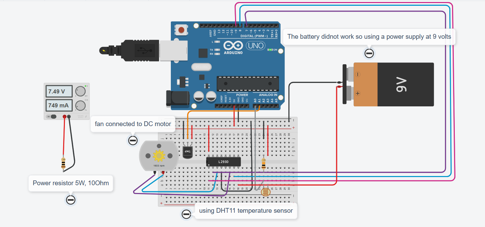

**PROJECT TITLE**

Adaptive Climate Control System with PID and Ambient Light Feedback

This project implements a closed-loop control system using an Arduino to maintain the temperature of an enclosed environment. The desired temperature (Setpoint) is dynamically adjusted based on ambient light levels (simulating a comfort/energy-saving model). Cooling is achieved using a DC fan controlled by a finely tuned PID algorithm.

**AUTHORS**

Erum Iftikhar M01088213

Gayathri Satheesh L M01087828

**PROBLEM STATEMENT**

The primary challenge is to create an energy-efficient and responsive climate control system that can stabilize the temperature of an enclosed space while adapting its target based on environmental context.

The main issue that was addressed was adaptive control, the system must vary the comfort level based on ambient light (LDR), setting a cooler target during high light and a warmer target during low light.

**Variables:**

Controlled Variable: Temperature (T_Actual in °C)

Desired Variable: Adaptive Setpoint (T_Setpoint in °C), calculated from LDR input.

Disturbances: Ambient room temperature fluctuations, environmental heat (adjacent electronics), and the simulated heat disturbance from the 5 W, 10Ω power resistor.

**SOLUTION**

The solution employs an Arduino-based PID controller coupled with a critical power supply modification to enable effective variable speed cooling.

### Control System Overview

The system measures temperature (DHT11) and light (LDR). The LDR input is mapped to the target temperature (22.0 °C to 24.0°C). The error between the Actual and Setpoint temperature is fed into a **PID algorithm**, which outputs a constrained PWM signal (200-255) to the fan.

### Components Used

1.  **Microcontroller:** Arduino Uno

2.  **Feedback Sensor:** DHT11 Temperature and Humidity Sensor

3.  **Adaptive Input Sensor:** Photoresistor (LDR) with a 10kΩ resistor (voltage divider)

4.  **Display:** 16x2 I2C Liquid Crystal Display (LCD)

5.  **Actuator:** DC Motor (Cooling Fan)

6.  **Motor Driver:** L293D Dual H-Bridge Motor Driver

7.  **Power Supply:** External Power Supply for motor and power resistor (Power Supply in the lab)

8.  **Disturbance Source:** **Ceramic Power Resistor (**5W, 10Ω**)** used as a controlled heat source (simulated environmental disturbance).

### Safety Mechanism

**Constrained Operating Range:** To overcome the motor's high stall voltage, the PID output is constrained to a functional range within the code:

PWMApplied = max(PWMPID, 200)

This ensures that whenever the fan is commanded to run, it receives a minimum PWM of 200, guaranteeing rotation, while still allowing the PWM to vary dynamically up to 255 based on the increasing temperature error. This also necessitated the use of the 9V external supply for the L293D's VCC2 pin.

### Circuit and Wiring Diagram

### The circuit diagram below (generated in Tinkercad) details the connections, including the separation of the 5V logic supply and the 9V motor supply.

**Detailed Wiring Explanation**

 | Component | Pin | Connected To (Arduino/L293D) | Purpose |
| :--- | :--- | :--- | :--- |
| **L293D Power** | VCC1 (Pin 16) | Arduino 5V | Powers the chip's internal logic. |
| | VCC2 (Pin 8) | 9V Power Supply Positive (+) | Supplies the motor's high voltage. |
| | GND (Pins 4, 5) | Arduino GND and 9V Power Supply Negative (-) | Establishes the Common Ground for both power systems. |
| **L293D Control** | Enable 1 (Pin 1) | Digital Pin 9 (PWM) | Receives the variable speed signal from the PID output. |
| | Input 1 (Pin 2) | Digital Pin 7 | Motor Direction Control (Set HIGH). |
| | Input 2 (Pin 7) | Digital Pin 8 | Motor Direction Control (Set LOW). |
| **Cooling Fan** | Terminals | L293D Output 1 & 2 | Controlled by the L293D. |
| **LDR Sensor** | Signal | Analog Pin A0 | Reads ambient light intensity (Setpoint input). |
| **Heat Disturbance** | Terminals | External Power Supply | The 5W, 10Ω resistor simulates an environmental heat load. |

**PROCESS**

### Setup and Initial Prototyping

1.  **Component Integration:** Wired the DHT11 (Pin 2), LDR (A0), and I2C LCD (A4/A5) to the Arduino. The 5W, 10Ω **ceramic resistor** was connected to power supply.

2.  **Motor Stall Diagnosis:** Initially, the motor (powered by Arduino 5V) failed to run at PWM values below 255 required a kick-start movement.

3.  **Hardware Correction:** Introduced a separate 9V supply for the L293D VCC2 (Motor Supply) and established a common ground to enable higher voltage delivery and variable speed control.

### Software Development and Tuning

1.  **Code Base:** Integrated the `DHT.h`, `LiquidCrystal_I2C.h`, and `Wire``.h` libraries.

2.  **Adaptive Logic:** Implemented the `calculateAdaptiveSetpoint` function to map LDR readings to the (22.0 °C to 24.0°C) range.

3.  **PID Tuning:** Due to the system's size and the hardware constraints, the following iterative tuning was performed:

    -   Ki and Kd were initially set to 0.

    -   Kp was adjusted until the PWM showed variability, settling on Kp=60.0 to provide a dynamic range between 200 and 255.

    -   Final PID values: Kp=60.0, Ki=0.5, Kd=0.0.

4.  **Range Implementation:** Implemented the `applyFanOutput()` logic to enforce the minimum PWM threshold of 200 to guarantee motor spin.

RESULT
------

The Adaptive Climate Controller successfully stabilized the temperature around the dynamic setpoint. When the LDR read bright conditions (Setpoint 22°C), the fan engaged aggressively. When the light was low (Setpoint 24°C), the fan disengaged, and the temperature was allowed to rise. The system demonstrated its ability to recover from the heat disturbance introduced by the 5W, 10Ω **resistor**, quickly increasing the fan PWM above 200 to counteract the temperature spike.

-   **Steady-State Error:** The system achieved eliminating the steady-state error around the setpoint, indicating that the integral term (K~i~) was effective.

-   **PWM Response:** The fan speed successfully modulated between 200 and 255 PWM, confirming that the hardware and software fixes allowed for effective PID control

**REFLECTION**

**What Went Well:**

-   The adaptive setpoint logic worked flawlessly, immediately adjusting the target temperature based on the LDR.

-   The use of the constrained PWM logic along with the 9V power supply successfully overcame the motor's high stall voltage problem.

**What Went Wrong:**

-   The initial diagnosis regarding the motor stall was time-consuming. We initially assumed a simple coding fix when the problem was fundamentally a **lack of sufficient power (voltage)** supplied by the Arduino to the L293D motor output.

-   **The first attempt to fix the voltage problem using a standard 9V battery failed . We ultimately had to switch to a stable 9V lab power supply.**

-   Initial high Kp values saturated the PWM at 255, requiring several debugging iterations to find the optimal Kp to expose the full dynamic range of 200-255.

**What I Learned:**

-   **Actuator Limitations:** Never assume a motor will start at 0 PWM; always determine the minimum required voltage (stall voltage).

-   **Motor Driver Power:** The VCC2 and VCC1 pins on an L293D are separate for a critical reason: one is for logic, the other for high current, and the motor supply must be external and often higher than 5V.

-   **PID Tuning:** Kp is a multiplier for error; an aggressive Kp will immediately saturate the PWM output, rendering the rest of the PID control useless for variable speed.

**YOUTUBE LINK:**https://www.youtube.com/playlist?list=PL-FWyHN1v5SLkw_UbEsgiCWoWJX2MbhVE

**CONTRIBUTION MATRIX**

| **Student Name** | **Task Description** |
| :--- | :--- |
| Erum Iftikhar | Hardware wiring, Software development (PID integration, adaptive logic), Serial debugging, PID tuning, Video production, Tinkercad diagram |
| Gayathri Satheesh | Separate Component Testing, Report writing. |

**REFERENCES**

1.  Datasheet for L293D Motor Driver.

2.  Generative AI Assistance (Gemini): Used for debugging stray characters, PID logic correction, motor stall diagnosis, and project report structuring.

3.  Generative AI Prompt: "refactor the existing Arduino code using manual PID formulas instead of the PID_v1.h library, incorporating anti-windup and smooth scaling."

4.  Generative AI Prompt: "my motor is not working at lower speed, can you tell the wiring again for the 9V battery and L293D to enable PWM control?"
